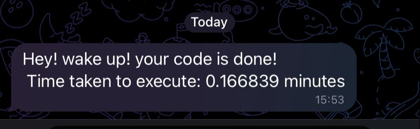
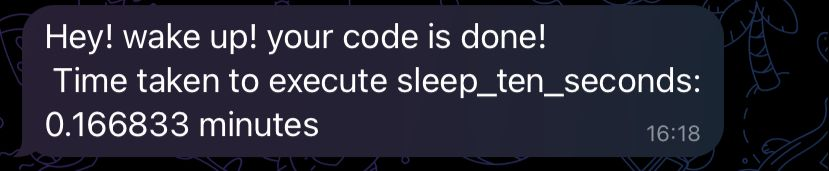

# Back to sit! 🐒


## Description

Had you ever went for a break meanwhile your model/code is running? Yeah! right? But it is very upset when you have to return to your computer every 5 minutes to see if your code is still running! 😴 Maybe you were resting in your bed and you have to wake up to check it out! what a bother! 😤 What about if you get notified to your phone once your code has run?

**Back to sit** does this for you! **Back to sit** library notify directly to your telegram chat just when your job is done! and also report you the time took to accomplish the task.

---

## Installation

To install back_to_sit library you can use pip:

```bash
pip install back-to-sit
```

## Usage

Using the **Back to Sit** library is easy. First, you need to create a Telegram bot and obtain an API token. You can follow the instructions on the **[Telegram website](https://core.telegram.org/bots#3-how-do-i-create-a-bot)** to create a bot and obtain an **API token** (or easily read the instructions below). Lastly, you need to obtain your ***chat id.***

Here I will show you how to get both: 

### API Token 🤖

First you need to create your own bot 🤖. This bot will be your messenger! 💌

To create it, follow the next steps:

1. Install Telegram in your smartphone
2. Go to Chats → Search Chats → Type ***BotFather***
3. There to create your bot you can simply follow the instructions. But it should be something like this:

```latex
/newbot

bot_name # You choose this

examplebot_bot # You choose this
```

1. Finally, get the token API that **BotFather** bring to you. Nice! As simple as that you have your **API token**

### Chat ID

Now, you will create a “universal” bot, it means that anyone could chat with him/her. So you need to correctly identify the chat between the bot and you! To do this follow the steps:

1. Search your bot. In telegram go to Chats → Search Chats → Type the username of your bot (Ex: examplebot_bot) and enter to the chat.
2. Write a dummy message to the bot. (For example, ”Hello world”)
3. In your navigator, enter to `https://api.telegram.org/bot{TOKEN_API}/getUpdates`. Replace {TOKEN_API} with your **API token**.
4. Here you will see a payload with the messages, from the payload you should just get the ***“id”***  number.

Payload Example:

```json
{"ok":true,"result":[{"update_id":9421735642,
"message":{"message_id":3,"from":{"id":6276864755,"is_bot":false,"first_name":"Diego","last_name":"Machado","language_code":"es"},"chat":{"id":6276864755,"first_name":"Diego","last_name":"Machado","type":"private"},"date":1682916041,"text":"Hello World"}}]}
```

In the example case, the `chat_id` is **6276864755**

<aside>
👀 If you get something like {"ok":true,"result":[]}. Try to send more messages and reload the step 3.

</aside>

---

Well Done! 🚀🚀🚀🚀🚀

Once you have the `API token` and the `chat id`, you are already done to use **back to sit**! You have two available options, use the `back_to_sit()`function or use the `@back_to_sit_decorator()`. We will navigate through them a little bit in the following sections:

### Function mode 🔨

This mode is useful when you are running tasks in your Jupyter notebook and don’t want to alter your function behavior. 

You can use `back_to_sit()` function mode in your code like this:

```python
# Import Libraries
from back_to_sit import back_to_sit
import time

# Define necessary constants
MESSAGE = "Hey! wake up! your code is done!"
CHAT_ID = "CHATIDNUMBER"
API_TOKEN = "API:TOKEN"

# Start time is optional if you want backtosit to report the time consumed
start_time = time.time()

# Some task code here ...
time.sleep(10)
####

# This line is executed after your task code is done! 
back_to_sit(MESSAGE, CHAT_ID, API_TOKEN, start_time, notebook = False)
```



<aside>
👀 Important! If your are running it in Jupyter notebooks, you should give the input parameter `notebook=True` , otherwise you should do `notebook=False`

</aside>

---

### Decorator mode ✨

This mode is useful when you want to get the *back to sit* report every time you use the function! or maybe if don’t want to add an extra line of code! 

You can use back-to-sit decorator mode in your code like this:

```python
# Import Libraries
from back_to_sit import back_to_sit
import time

# Define necessary constants
MESSAGE = "Hey! wake up! your code is done!"
CHAT_ID = "CHATIDNUMBER"
API_TOKEN = "API:TOKEN"

@back_to_sit_decorator(MESSAGE, CHAT_ID, API_TOKEN, notebook = False)
def sleep_ten_seconds():
  time.sleep(10)
  return None

```

In the decorator mode, the start time is configured automatically. So every time you execute the function you will get the back to sit report!

```python
go_sleep = sleep_ten_seconds()
```



<aside>
👀 Important! If your are running it in Jupyter notebooks, you should give the input parameter `notebook=True` , otherwise you should do `notebook=False`

</aside>

---

## **License**

The Back to Sit library is licensed under the MIT license. See the **`LICENSE`** file for more information.